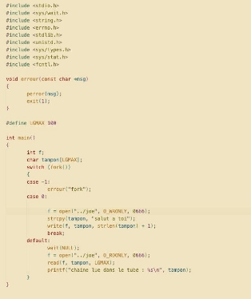
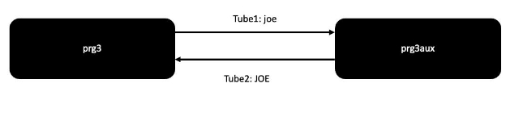
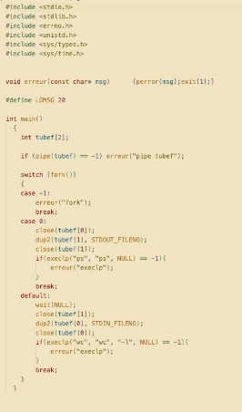

**SY40 TP5 / yann derré**

**PART I**

1. **Examinez prg1.c puis recompilez-le en mettant l'instruction close(pfd[1]) en commentaire. Comment expliquez-vous le résultat de l'exécution ?**

En commandant la ligne 34 close(pdf[0]), le programme ne fonctionne plus et n’affiche pas son output. Le tube étant ouvert en écriture à deux endroits, le programme ne fonctionne plus.

2. **Est-il possible de remplacer la boucle de lecture caractère par caractère en un seul appel read ?**

Actuellement, read ne lit qu’un caractère à la fois dans le buffer. On a un define LGMAXnous permettant de definir la taille totale pour lire l’entièreté du buffer.

3. **Modifiez le programme prg1.c pour que le processus fils écrive dans le tube depuis un autre exécutable.**

Programme1 écrit dans un tube accessible depuis un autre exécutable via un pipe nommé joe. On peut le créer via un fichier vide via touch, ou mknod qui est plus adapté.

4. **Examinez prg2.c et commentez-le.**

**Père**:

*Le père assigne la fonction traitantAbsenceLEcteur comme handler du signal SIGPIPE.*

*Le père écrit dans le tube*

*Le père attend la fin d’éxecution du fils*

**Fils**:

*Le fils attend une touche de l’utilisateur.*

*Le fils lit le tube*

*Le fils attend une seconde.*

**Fin du fils.**

**Père**:

*A la fin de l’exec fils, le père écrit dans le tube, réceptino du SIGPIPE*

*Déclenchement du handler, printf passage par…*

**Fin du programme.**

**PART II**

1. **Examinez prg3.c et faites un schéma représentant le mécanisme mis en œuvre.**

Deux tubes sont créés permettant à prog3 et prog3aux communiquent dans le sdeux sens. Prog3 exécute prog3aux qui va renvoyer une verison en majuscule du message reçu de tube1 dans tube2.

**Le père affiche ensuite le contenu du message reçu et recommence.**

2. **Ecrivez un programme prg4.c qui reproduit ce que fait le Shell en interprétant la ligne de commande ps | wc -l**

**On utilise dup2 pour rediriger la sortie et l’entrée standard dans le tube.**

 
